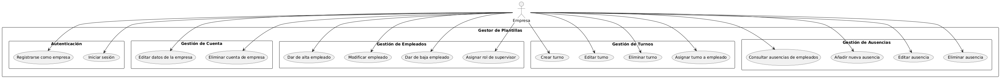

# GestorRH. Gestor de Personal y Turnos Empresariales

---

## Descripción

**GestorRH** es una aplicación de escritorio desarrollada en **Java** orientada a la **gestión integral de personal y recursos humanos** dentro de una empresa. Su objetivo principal es facilitar la administración de empleados, la planificación de turnos de trabajo y el control de ausencias, todo ello a través de una interfaz amigable y profesional.

El acceso al sistema parte del **registro de la empresa**, que se convierte en el único tipo de usuario con permisos administrativos globales. Una vez autenticada, la empresa puede realizar operaciones como dar de alta empleados, asignarles roles (empleado o supervisor), gestionar sus horarios laborales y registrar o validar ausencias.

La aplicación cuenta con una **interfaz gráfica desarrollada en JavaFX**, diseñada para ofrecer una experiencia intuitiva y fluida. El sistema sigue una **arquitectura en capas** basada en los patrones **MVC (Modelo-Vista-Controlador)** y **DAO (Data Access Object)**, lo que garantiza un diseño modular, mantenible y escalable.

En cuanto a la persistencia, se utiliza **MySQL** como sistema gestor de base de datos, con una estructura relacional que refleja fielmente las conexiones entre las distintas entidades: empresas, empleados, turnos y ausencias. Estas relaciones se modelan mediante **claves foráneas** y se optimizan mediante el uso de **consultas JOIN** para obtener información contextualizada.

En definitiva, **GestorRH** representa una solución **robusta y extensible** para empresas que buscan centralizar y optimizar la gestión de su plantilla de personal, con una base sólida tanto a nivel técnico como funcional.

### Tipos de Usuarios

- **Empresas**:

   - Gestionan sus empleados y departamentos
   - Crean y asignan turnos
   - Administran ausencias del personal
- **Empleados** (futura implementación):

   - Pueden ser Supervisores o Empleados regulares
   - Visualizan sus turnos asignados
   - Solicitan y gestionan ausencias

### Características Principales

- **Sistema de Autenticación**:

   - Protección mediante email y contraseña
   - Encriptación segura de contraseñas con BCrypt
   - Validación de datos de usuario
- **Gestión de Personal**:

   - Control de empleados activos/inactivos
   - Asignación de roles y departamentos
   - Seguimiento de ausencias
- **Persistencia de Datos**:

   - Almacenamiento en base de datos MySQL
   - Gestión de conexiones segura
   - Logging de operaciones críticas

---

## Tecnologías Detalladas

### Java Core

- Versión: Java 23
- Características utilizadas:
   - Collections Framework
   - Programación orientada a objetos
   - Manejo de excepciones personalizadas

### JavaFX

- Versión: 17.0.12
- Componentes:
   - FXML para diseño de interfaces
   - CSS para estilos
   - Controladores para lógica de UI

### MySQL

- Versión: 8.0.33
- Características:
   - Conexiones pooling
   - Transacciones ACID
   - Claves foráneas y CASCADE

### Otras Tecnologías

- SLF4J y Logback para logging
- JBCrypt para encriptación
- JAXB para configuración XML
- JUnit 5 para testing

---

## Arquitectura

- **Tipo**: Aplicación de escritorio
- **Patrones**: MVC (Modelo-Vista-Controlador), DAO (Data Access Object)
- **Persistencia**: MySQL
- **UI**: JavaFX

---
## Diagramas
### Diagrama de Clases
Incluye las entidades Empresa, Empleado, Turno, Ausencia, y sus relaciones DAO/Vista/Controlador.


### Diagrama de Casos de Uso
Muestra los distintos casos de uso disponibles para cada tipo de usuario (empresa, supervisor, empleado).


### Diagrama Entidad-Relación (Base de Datos)
Representa las tablas empresa, empleado, ausencia, turno, pertenece y sus relaciones mediante claves foráneas.


---
## Estructura de la Base de Datos

La base de datos `gestion_plantillas` utiliza el conjunto de caracteres UTF-8 y el motor InnoDB. Se compone de las siguientes tablas:

### Tabla `empresa`

- Almacena información de empresas registradas
- Campos principales:
   - `id_empresa`: Identificador único
   - `nombre`: Nombre de la empresa (único)
   - `email`: Correo electrónico (único)
   - `password_hash`: Contraseña encriptada

### Tabla `empleado`

- Registro de empleados de cada empresa
- Campos principales:
   - `id_usuario`: Identificador único
   - `nombre` y `apellidos`: Datos personales
   - `rol`: SUPERVISOR o EMPLEADO
   - `id_empresa`: Empresa a la que pertenece

### Tabla `ausencia`

- Control de ausencias del personal
- Campos principales:
   - `motivo`: Razón de la ausencia
   - `fecha_inicio` y `fecha_fin`: Período
   - `id_empleado`: Empleado ausente

### Tabla `turno`

- Definición de turnos de trabajo
- Campos principales:
   - `descripcion`: Nombre del turno
   - `hora_inicio` y `hora_fin`: Horario

### Tabla `pertenece`

- Asignación de turnos a empleados
- Relación many-to-many entre empleados y turnos
- Incluye fecha específica de asignación

---
## Estructura del Proyecto

### `src/main/java/org/dam/fcojavier/gestionpersonal/`

- **controllers/**: Controladores de JavaFX
- **DAOs/**: Acceso a datos
- **model/**: Entidades del dominio
- **utils/**: Utilidades generales
- **exceptions/**: Excepciones personalizadas
- **interfaces/**: Interfaces del sistema
- **bbdd/**: Gestión de conexiones
- **enums/**: Enumeraciones

---
## Requisitos y Ejecución

### Requisitos
- Java 23
- MySQL 8.0.33
- Maven 3.9+

### Instalación
1. Clonar el repositorio
2. Ejecutar el script SQL para crear la base de datos
3. Configurar credenciales en connection.xml
4. Ejecutar:
   ```bash
   mvn clean install
   ```
5. Lanzar la aplicación:
   ```bash
   mvn javafx:run
   ```

---
## Funcionalidades principales

- Registro e inicio de sesión de empresas
- Gestión completa de empleados
- Control de turnos y horarios
- Registro y seguimiento de ausencias
- Sistema de roles y permisos
- Logging de operaciones críticas
- Interfaz gráfica intuitiva

---
## Consideraciones

- Las contraseñas se almacenan encriptadas con BCrypt
- Se utiliza el patrón DAO para acceso a datos
- La conexión a base de datos se configura mediante XML
- Los logs se almacenan en archivos diarios
- Soporte para múltiples empresas en la misma base de datos

---
## Estado del proyecto

**Estado**: En desarrollo activo

**Pendiente**:
- **Exportación de informes**: Permite generar y guardar reportes detallados sobre la gestión de personal y turnos en formatos comunes como PDF o Excel, facilitando el análisis y la presentación de datos a la dirección o clientes. 
- **Notificaciones por email**: Envía alertas automáticas a empleados y supervisores sobre eventos importantes, como nuevos turnos asignados, cambios o recordatorios, mejorando la comunicación y reduciendo errores.
- **Sistema de fichaje**: Implementa un mecanismo para que los empleados registren su entrada y salida en el sistema, proporcionando un control preciso del tiempo trabajado y facilitando el cálculo de horas y asistencia.
- **Calendario visual de turnos**: Integra una interfaz gráfica tipo calendario que muestra de forma clara y sencilla los turnos asignados a cada empleado, facilitando la planificación y consulta rápida de horarios.
- **Implementación de login para más usuarios (empleados y supervisores)**: Amplía el sistema de autenticación para soportar múltiples perfiles de usuario con distintos niveles de acceso y permisos, asegurando que cada rol pueda acceder solo a las funciones que le corresponden.

---
## Autor

- Hecho por:
   - Fco Javier García Cañero
- Proyecto académico para IES Francisco de los Rios
